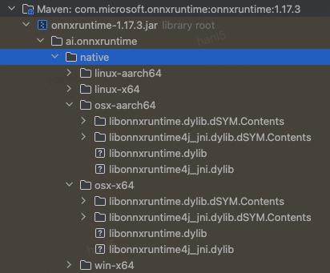

# Hello [ORT(OnnxRumTime)](https://onnxruntime.ai/)

An ONNX(Open Neural Network Exchange) Runtime Demo in Java

## About ORT
- Github: https://github.com/microsoft/onnxruntime
- Maven Repo: https://mvnrepository.com/artifact/com.microsoft.onnxruntime
- ORT Architecture: 
- ORT Workflow: 
  
  - [TensorRT](https://developer.nvidia.com/tensorrt)
  - [PyTorch](https://pytorch.org/)
  - [TensorFlow](https://www.tensorflow.org/)
  - [onnx runtime](https://onnxruntime.ai/)
  - [OpenVino](https://openvino.ai/)

## About Inference Service on ORT Demo
> [YOLO(You only look once)](https://pjreddie.com/darknet/yolo)
> 
> - Paper: https://arxiv.org/abs/1506.02640
> - Engineering: from https://github.com/jhgan00/java-ort-example-yolov5.git

```sh
mvn clean test -Dtest=HelloOrtTests#testImage
```


```sh
detectionList:[{"label":"mouse","bbox":[198.35149,119.59349,224.45099,158.48425],"confidence":0.91583246},{"label":"laptop","bbox":[54.62196,24.271353,186.86736,121.20319],"confidence":0.6366785}]
```


## About dependencies

### 1 [CUDA](CUDA.md)

**Microarchitecture**

1. [Tesla](https://en.wikipedia.org/wiki/Tesla_(microarchitecture))  [特斯拉](https://zh.wikipedia.org/wiki/%E5%B0%BC%E5%8F%A4%E6%8B%89%C2%B7%E7%89%B9%E6%96%AF%E6%8B%89)
2. [Fermi](https://en.wikipedia.org/wiki/Fermi_(microarchitecture))  [费米](https://zh.wikipedia.org/wiki/%E6%81%A9%E9%87%8C%E7%A7%91%C2%B7%E8%B4%B9%E7%B1%B3) 
3. [Kepler](https://en.wikipedia.org/wiki/Kepler_(microarchitecture)) [开普勒](https://zh.wikipedia.org/wiki/%E7%BA%A6%E7%BF%B0%E5%86%85%E6%96%AF%C2%B7%E5%BC%80%E6%99%AE%E5%8B%92) 
4. [Maxwell](https://en.wikipedia.org/wiki/Maxwell_(microarchitecture)) [麦克斯韦](https://zh.wikipedia.org/wiki/%E8%A9%B9%E5%A7%86%E6%96%AF%C2%B7%E5%85%8B%E6%8B%89%E5%85%8B%C2%B7%E9%BA%A6%E5%85%8B%E6%96%AF%E9%9F%A6) 
5. [Pascal](https://en.wikipedia.org/wiki/Pascal_(microarchitecture))  [帕斯卡](https://zh.wikipedia.org/wiki/%E5%B8%83%E8%8E%B1%E5%85%B9%C2%B7%E5%B8%95%E6%96%AF%E5%8D%A1)
6. [Volta](https://en.wikipedia.org/wiki/Volta_(microarchitecture))  [伏打](https://zh.wikipedia.org/wiki/%E4%BA%9E%E6%AD%B7%E5%B1%B1%E5%BE%B7%E7%BE%85%C2%B7%E4%BC%8F%E6%89%93)
7. [Turing](https://en.wikipedia.org/wiki/Turing_(microarchitecture))  [图灵](https://zh.wikipedia.org/wiki/%E8%89%BE%E4%BC%A6%C2%B7%E5%9B%BE%E7%81%B5)
8. [Ampere](https://en.wikipedia.org/wiki/Ampere_(microarchitecture))  [安培](https://zh.wikipedia.org/wiki/%E5%AE%89%E5%BE%B7%E7%83%88-%E9%A6%AC%E9%87%8C%C2%B7%E5%AE%89%E5%9F%B9) 
9. [Ada Lovelace](https://en.wikipedia.org/wiki/Ada_Lovelace_(microarchitecture))  [阿达·洛芙莱斯](https://zh.wikipedia.org/wiki/%E5%AE%89%E5%BE%B7%E7%83%88-%E9%A6%AC%E9%87%8C%C2%B7%E5%AE%89%E5%9F%B9) 
10. [Hopper](https://en.wikipedia.org/wiki/Hopper_(microarchitecture)) [格蕾丝·赫柏](https://zh.wikipedia.org/wiki/%E8%91%9B%E9%BA%97%E7%B5%B2%C2%B7%E9%9C%8D%E6%99%AE) 
11. [Blackwell](https://en.wikipedia.org/wiki/Blackwell_(microarchitecture))  [戴维·布莱克维尔](https://zh.wikipedia.org/wiki/%E6%88%B4%E7%BB%B4%C2%B7%E5%B8%83%E8%8E%B1%E5%85%8B%E9%9F%A6%E5%B0%94)

**Board Product series**

1. **Desktop**
   - GeForce series
   - RTX series
2. **Workstation**
   - Quadro series
   - Quadro NVS series
3. **Data Center**
   - Tesla series
4. **Mobile**
   - Tegra series
5. **Embedded Computing**
   - Jetson series
6. **Autonomous car and driver assistance**
   - Drive series

#### 1 Requirements

https://onnxruntime.ai/docs/execution-providers/CUDA-ExecutionProvider.html#requirements

https://docs.nvidia.com/deeplearning/cudnn/latest/installation/overview.html

#### 2 CUDA(Compute Unified Device Architecture)

- `11.8` https://developer.nvidia.com/cuda-11-8-0-download-archive
- `12` https://developer.nvidia.com/cuda-downloads

#### 3 CUDA Deep Neural Network library (cuDNN)

https://developer.nvidia.com/cudnn-downloads

### 2 CoreML

https://developer.apple.com/documentation/coreml

Which devices have an ANE?

https://github.com/hollance/neural-engine/blob/master/docs/supported-devices.md

## MORE…

### Issues solved

#### UnsatisfiedLinkError on MacOS

```sh
UnsatisfiedLink no onnxruntime in java.library.path
```
reload the dependency jar file and check it:



### A Deep Dive into ONNX & ONNX Runtime

- https://medium.com/becoming-human/a-deep-dive-into-onnx-onnx-runtime-part-1-874517c66ffc
- https://medium.com/becoming-human/a-deep-dive-into-onnx-onnx-runtime-part-2-785b523e0cca
